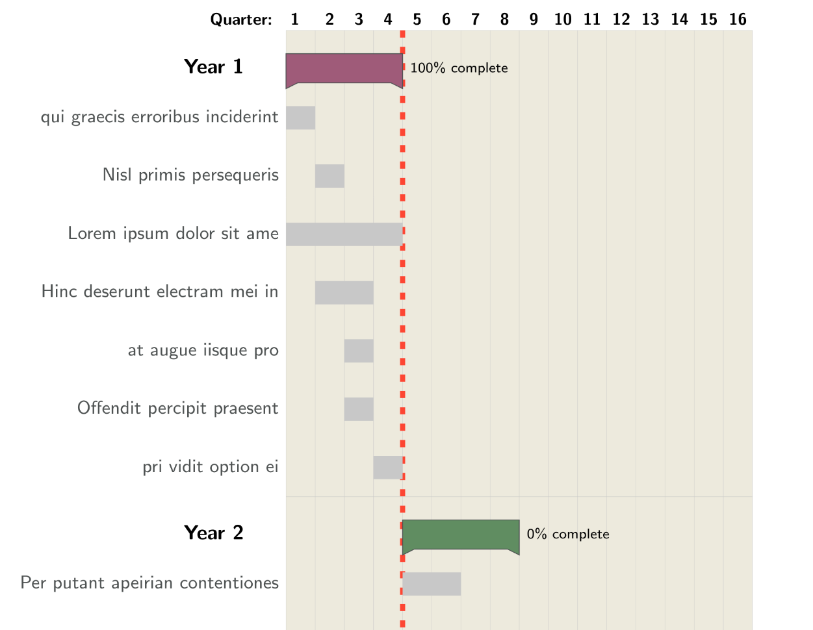

# gruvbox-gantt-charts-with-pgfgantt
I adopted this latex gantt chart example: https://www.overleaf.com/latex/examples/gantt-charts-with-the-pgfgantt-package/jmkwfxrnfxnw
to have gruvbox colors: https://github.com/morhetz/gruvbox. I also changed some fonts and other styling bits. 
I found it useful for planning projects. See example below. 

